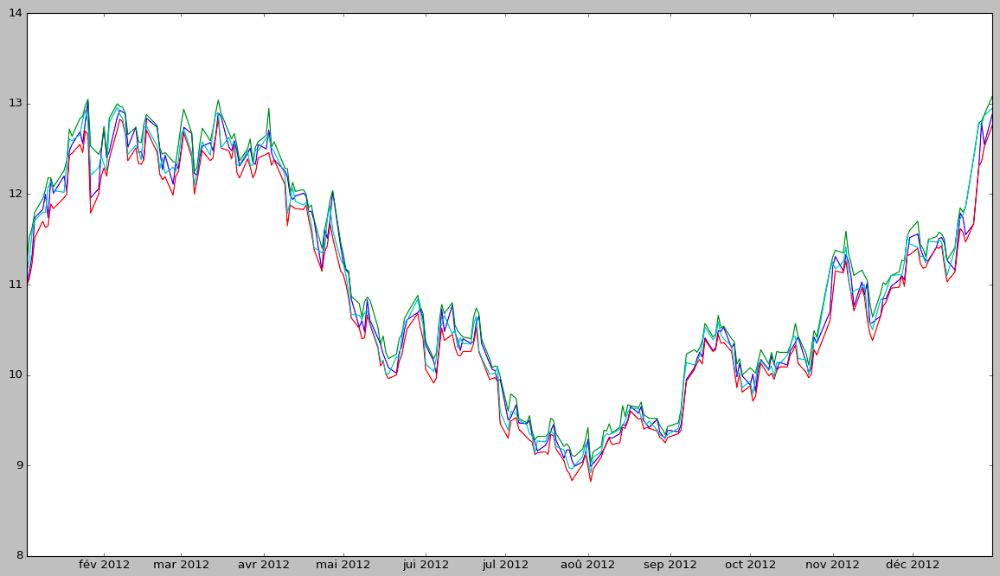
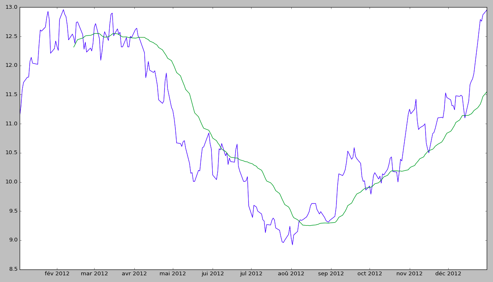
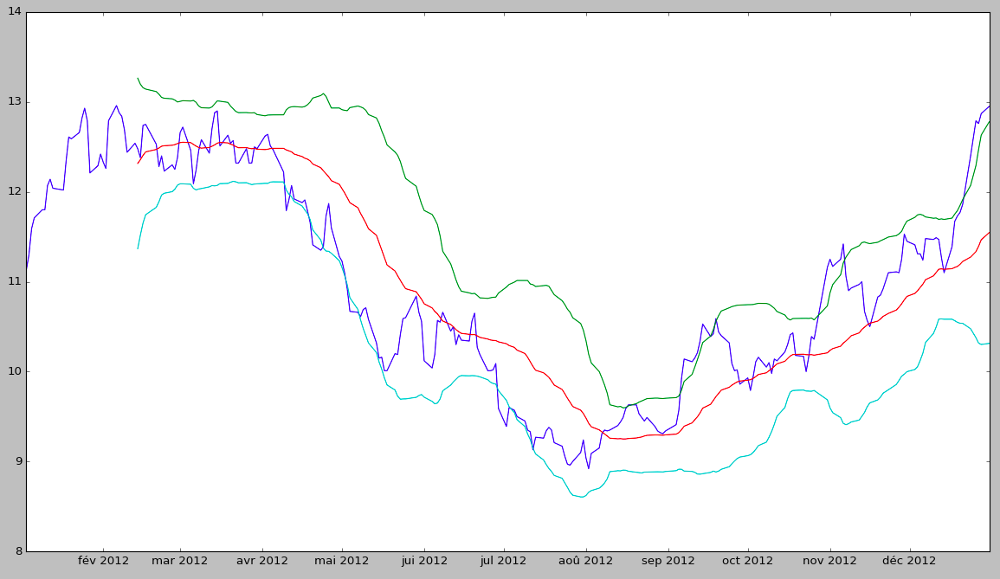

# TA-Lib

[](https://travis-ci.org/femtotrader/TALib.jl)
[](https://ci.appveyor.com/project/femtotrader/talib-jl/branch/master)
[](https://coveralls.io/github/femtotrader/TALib.jl?branch=master)
[](http://codecov.io/github/femtotrader/TALib.jl?branch=master)

A [Julia](http://julialang.org/) wrapper for [TA-Lib](http://ta-lib.org/) (Technical Analysis Library)

## Sample / Features

See [sample.jl](https://github.com/femtotrader/TALib.jl/blob/master/sample.jl)

TALib.jl supports both Array and DataFrames thanks to [multiple dispatch](https://en.wikipedia.org/wiki/Multiple_dispatch).

```julia
julia> using TALib

julia> using DataFrames
julia> filename = "test/ford_2012.csv"
julia> dfOHLCV = readtable(filename)
julia> dfOHLCV[:Date] = Date(dfOHLCV[:Date])
julia> dfOHLCV
250x6 DataFrames.DataFrame
│ Row │ Date       │ Open  │ High  │ Low   │ Close │ Volume    │
├─────┼────────────┼───────┼───────┼───────┼───────┼───────────┤
│ 1   │ 2012-01-03 │ 11.0  │ 11.25 │ 10.99 │ 11.13 │ 45709900  │
│ 2   │ 2012-01-04 │ 11.15 │ 11.53 │ 11.07 │ 11.3  │ 79725200  │
│ 3   │ 2012-01-05 │ 11.33 │ 11.63 │ 11.24 │ 11.59 │ 67877500  │
│ 4   │ 2012-01-06 │ 11.74 │ 11.8  │ 11.52 │ 11.71 │ 59840700  │
│ 5   │ 2012-01-09 │ 11.83 │ 11.95 │ 11.7  │ 11.8  │ 53981500  │
│ 6   │ 2012-01-10 │ 12.0  │ 12.05 │ 11.63 │ 11.8  │ 121750600 │
│ 7   │ 2012-01-11 │ 11.74 │ 12.18 │ 11.65 │ 12.07 │ 63806000  │
│ 8   │ 2012-01-12 │ 12.16 │ 12.18 │ 11.89 │ 12.14 │ 48687700  │
│ 9   │ 2012-01-13 │ 12.01 │ 12.08 │ 11.84 │ 12.04 │ 46366700  │
│ 10  │ 2012-01-17 │ 12.2  │ 12.26 │ 11.96 │ 12.02 │ 44398400  │
│ 11  │ 2012-01-18 │ 12.03 │ 12.37 │ 12.0  │ 12.34 │ 47102700  │
│ 12  │ 2012-01-19 │ 12.48 │ 12.72 │ 12.43 │ 12.61 │ 70894200  │
│ 13  │ 2012-01-20 │ 12.55 │ 12.64 │ 12.45 │ 12.59 │ 43705700  │
│ 14  │ 2012-01-23 │ 12.69 │ 12.84 │ 12.55 │ 12.66 │ 49379700  │
│ 15  │ 2012-01-24 │ 12.56 │ 12.86 │ 12.46 │ 12.82 │ 45768400  │
│ 16  │ 2012-01-25 │ 12.8  │ 12.98 │ 12.7  │ 12.93 │ 54021600  │
│ 17  │ 2012-01-26 │ 13.03 │ 13.05 │ 12.66 │ 12.79 │ 75470700  │
│ 18  │ 2012-01-27 │ 11.96 │ 12.53 │ 11.79 │ 12.21 │ 142155300 │
⋮
│ 232 │ 2012-12-04 │ 11.4  │ 11.44 │ 11.23 │ 11.31 │ 37760200  │
│ 233 │ 2012-12-05 │ 11.32 │ 11.4  │ 11.18 │ 11.31 │ 33152400  │
│ 234 │ 2012-12-06 │ 11.26 │ 11.31 │ 11.19 │ 11.24 │ 31065800  │
│ 235 │ 2012-12-07 │ 11.27 │ 11.5  │ 11.26 │ 11.48 │ 38404500  │
│ 236 │ 2012-12-10 │ 11.41 │ 11.53 │ 11.41 │ 11.47 │ 26025200  │
│ 237 │ 2012-12-11 │ 11.51 │ 11.58 │ 11.4  │ 11.49 │ 36326900  │
│ 238 │ 2012-12-12 │ 11.52 │ 11.56 │ 11.43 │ 11.47 │ 31099900  │
│ 239 │ 2012-12-13 │ 11.46 │ 11.5  │ 11.21 │ 11.27 │ 35443200  │
│ 240 │ 2012-12-14 │ 11.27 │ 11.27 │ 11.03 │ 11.1  │ 36933500  │
│ 241 │ 2012-12-17 │ 11.16 │ 11.41 │ 11.14 │ 11.39 │ 46983300  │
│ 242 │ 2012-12-18 │ 11.48 │ 11.68 │ 11.4  │ 11.67 │ 61810400  │
│ 243 │ 2012-12-19 │ 11.79 │ 11.85 │ 11.62 │ 11.73 │ 54884700  │
│ 244 │ 2012-12-20 │ 11.74 │ 11.8  │ 11.58 │ 11.77 │ 47750100  │
│ 245 │ 2012-12-21 │ 11.55 │ 11.86 │ 11.47 │ 11.86 │ 94489300  │
│ 246 │ 2012-12-24 │ 11.67 │ 12.4  │ 11.67 │ 12.4  │ 91734900  │
│ 247 │ 2012-12-26 │ 12.31 │ 12.79 │ 12.31 │ 12.79 │ 140331900 │
│ 248 │ 2012-12-27 │ 12.79 │ 12.81 │ 12.36 │ 12.76 │ 108315100 │
│ 249 │ 2012-12-28 │ 12.55 │ 12.88 │ 12.52 │ 12.87 │ 95668600  │
│ 250 │ 2012-12-31 │ 12.88 │ 13.08 │ 12.76 │ 12.95 │ 106908900 │
```



### Moving Average

```julia
julia> indic = MA(dfOHLCV, price=:Close)
250x2 DataFrames.DataFrame
│ Row │ Date       │ Value   │
├─────┼────────────┼─────────┤
│ 1   │ 2012-01-03 │ NaN     │
│ 2   │ 2012-01-04 │ NaN     │
│ 3   │ 2012-01-05 │ NaN     │
│ 4   │ 2012-01-06 │ NaN     │
│ 5   │ 2012-01-09 │ NaN     │
│ 6   │ 2012-01-10 │ NaN     │
│ 7   │ 2012-01-11 │ NaN     │
│ 8   │ 2012-01-12 │ NaN     │
│ 9   │ 2012-01-13 │ NaN     │
│ 10  │ 2012-01-17 │ NaN     │
│ 11  │ 2012-01-18 │ NaN     │
│ 12  │ 2012-01-19 │ NaN     │
│ 13  │ 2012-01-20 │ NaN     │
│ 14  │ 2012-01-23 │ NaN     │
│ 15  │ 2012-01-24 │ NaN     │
│ 16  │ 2012-01-25 │ NaN     │
│ 17  │ 2012-01-26 │ NaN     │
│ 18  │ 2012-01-27 │ NaN     │
⋮
│ 232 │ 2012-12-04 │ 10.8993 │
│ 233 │ 2012-12-05 │ 10.937  │
│ 234 │ 2012-12-06 │ 10.9727 │
│ 235 │ 2012-12-07 │ 11.022  │
│ 236 │ 2012-12-10 │ 11.0653 │
│ 237 │ 2012-12-11 │ 11.102  │
│ 238 │ 2012-12-12 │ 11.139  │
│ 239 │ 2012-12-13 │ 11.1427 │
│ 240 │ 2012-12-14 │ 11.1377 │
│ 241 │ 2012-12-17 │ 11.145  │
│ 242 │ 2012-12-18 │ 11.159  │
│ 243 │ 2012-12-19 │ 11.1693 │
│ 244 │ 2012-12-20 │ 11.193  │
│ 245 │ 2012-12-21 │ 11.225  │
│ 246 │ 2012-12-24 │ 11.274  │
│ 247 │ 2012-12-26 │ 11.3347 │
│ 248 │ 2012-12-27 │ 11.3933 │
│ 249 │ 2012-12-28 │ 11.4667 │
│ 250 │ 2012-12-31 │ 11.546  │

julia> using PyPlot
julia> plot(dfOHLCV[:Date], dfOHLCV[:Close], dfOHLCV[:Date], indic)
```



### Bollinger Bands

```julia
julia> indic = BBANDS(dfOHLCV, price=:Close)
250x4 DataFrames.DataFrame
│ Row │ Date       │ UpperBand │ MiddleBand │ LowerBand │
├─────┼────────────┼───────────┼────────────┼───────────┤
│ 1   │ 2012-01-03 │ NaN       │ NaN        │ NaN       │
│ 2   │ 2012-01-04 │ NaN       │ NaN        │ NaN       │
│ 3   │ 2012-01-05 │ NaN       │ NaN        │ NaN       │
│ 4   │ 2012-01-06 │ NaN       │ NaN        │ NaN       │
│ 5   │ 2012-01-09 │ NaN       │ NaN        │ NaN       │
│ 6   │ 2012-01-10 │ NaN       │ NaN        │ NaN       │
│ 7   │ 2012-01-11 │ NaN       │ NaN        │ NaN       │
│ 8   │ 2012-01-12 │ NaN       │ NaN        │ NaN       │
│ 9   │ 2012-01-13 │ NaN       │ NaN        │ NaN       │
│ 10  │ 2012-01-17 │ NaN       │ NaN        │ NaN       │
│ 11  │ 2012-01-18 │ NaN       │ NaN        │ NaN       │
│ 12  │ 2012-01-19 │ NaN       │ NaN        │ NaN       │
│ 13  │ 2012-01-20 │ NaN       │ NaN        │ NaN       │
│ 14  │ 2012-01-23 │ NaN       │ NaN        │ NaN       │
│ 15  │ 2012-01-24 │ NaN       │ NaN        │ NaN       │
│ 16  │ 2012-01-25 │ NaN       │ NaN        │ NaN       │
│ 17  │ 2012-01-26 │ NaN       │ NaN        │ NaN       │
│ 18  │ 2012-01-27 │ NaN       │ NaN        │ NaN       │
⋮
│ 232 │ 2012-12-04 │ 11.7437   │ 10.8993    │ 10.055    │
│ 233 │ 2012-12-05 │ 11.7499   │ 10.937     │ 10.1241   │
│ 234 │ 2012-12-06 │ 11.7404   │ 10.9727    │ 10.2049   │
│ 235 │ 2012-12-07 │ 11.7205   │ 11.022     │ 10.3235   │
│ 236 │ 2012-12-10 │ 11.7059   │ 11.0653    │ 10.4247   │
│ 237 │ 2012-12-11 │ 11.7088   │ 11.102     │ 10.4952   │
│ 238 │ 2012-12-12 │ 11.6934   │ 11.139     │ 10.5846   │
│ 239 │ 2012-12-13 │ 11.6991   │ 11.1427    │ 10.5863   │
│ 240 │ 2012-12-14 │ 11.6928   │ 11.1377    │ 10.5825   │
│ 241 │ 2012-12-17 │ 11.7074   │ 11.145     │ 10.5826   │
│ 242 │ 2012-12-18 │ 11.7513   │ 11.159     │ 10.5667   │
│ 243 │ 2012-12-19 │ 11.7896   │ 11.1693    │ 10.549    │
│ 244 │ 2012-12-20 │ 11.848    │ 11.193     │ 10.538    │
│ 245 │ 2012-12-21 │ 11.9126   │ 11.225     │ 10.5374   │
│ 246 │ 2012-12-24 │ 12.0713   │ 11.274     │ 10.4767   │
│ 247 │ 2012-12-26 │ 12.2913   │ 11.3347    │ 10.3781   │
│ 248 │ 2012-12-27 │ 12.4691   │ 11.3933    │ 10.3176   │
│ 249 │ 2012-12-28 │ 12.6315   │ 11.4667    │ 10.3019   │
│ 250 │ 2012-12-31 │ 12.778    │ 11.546     │ 10.314    │

julia> plot(
    dfOHLCV[:Date], dfOHLCV[:Close],
    dfOHLCV[:Date], indic[:UpperBand],
    dfOHLCV[:Date], indic[:MiddleBand],
    dfOHLCV[:Date], indic[:LowerBand],
)

```



## Indicators

An `Array` containing `Symbol`s of available TA-Lib indicators can be displayed using:

```julia
julia> INDICATORS
158-element Array{Symbol,1}:
 :ACOS
 :AD
 :ADD
 :ADOSC
 :ADX
 :ADXR
 :APO
 :AROON
 :AROONOSC
 :ASIN
 :ATAN
 :ATR
 :AVGPRICE
 :BBANDS
 :BETA
 :BOP
 :CCI
 :CDL2CROWS
 :CDL3BLACKCROWS
 ⋮
 :STOCH
 :STOCHF
 :STOCHRSI
 :SUB
 :SUM
 :T3
 :TAN
 :TANH
 :TEMA
 :TRANGE
 :TRIMA
 :TRIX
 :TSF
 :TYPPRICE
 :ULTOSC
 :VAR
 :WCLPRICE
 :WILLR
 :WMA
```

An `OrderedDict` containing properties (required parameters, optional parameters, default values...)
of available TA-Lib indicators can be displayed using:

```julia
julia> D_INDICATORS
DataStructures.OrderedDict{Symbol,Any} with 158 entries:
  :ACOS                => Dict{AbstractString,Any}("GroupId"=>"Math Transform","CamelCaseName"=>"Acos","OutputArguments"=>[Dict{AbstractString,Any}("Flags"=>Dict{AbstractString,Any}("Flag"=>"Line"…
  :AD                  => Dict{AbstractString,Any}("GroupId"=>"Volume Indicators","CamelCaseName"=>"Ad","OutputArguments"=>[Dict{AbstractString,Any}("Flags"=>Dict{AbstractString,Any}("Flag"=>"Line…
  :ADD                 => Dict{AbstractString,Any}("GroupId"=>"Math Operators","CamelCaseName"=>"Add","OutputArguments"=>[Dict{AbstractString,Any}("Flags"=>Dict{AbstractString,Any}("Flag"=>"Line")…
  :ADOSC               => Dict{AbstractString,Any}("GroupId"=>"Volume Indicators","CamelCaseName"=>"AdOsc","OutputArguments"=>[Dict{AbstractString,Any}("Flags"=>Dict{AbstractString,Any}("Flag"=>"L…
  :ADX                 => Dict{AbstractString,Any}("GroupId"=>"Momentum Indicators","Flags"=>Dict{AbstractString,Any}("Flag"=>"Unstable Period"),"CamelCaseName"=>"Adx","OutputArguments"=>[Dict{Abs…
  :ADXR                => Dict{AbstractString,Any}("GroupId"=>"Momentum Indicators","Flags"=>Dict{AbstractString,Any}("Flag"=>"Unstable Period"),"CamelCaseName"=>"Adxr","OutputArguments"=>[Dict{Ab…
  :APO                 => Dict{AbstractString,Any}("GroupId"=>"Momentum Indicators","CamelCaseName"=>"Apo","OutputArguments"=>[Dict{AbstractString,Any}("Flags"=>Dict{AbstractString,Any}("Flag"=>"L…
  :AROON               => Dict{AbstractString,Any}("GroupId"=>"Momentum Indicators","CamelCaseName"=>"Aroon","OutputArguments"=>Any[Dict{AbstractString,Any}("Flags"=>Dict{AbstractString,Any}("Flag…
  :AROONOSC            => Dict{AbstractString,Any}("GroupId"=>"Momentum Indicators","CamelCaseName"=>"AroonOsc","OutputArguments"=>[Dict{AbstractString,Any}("Flags"=>Dict{AbstractString,Any}("Flag…
  :ASIN                => Dict{AbstractString,Any}("GroupId"=>"Math Transform","CamelCaseName"=>"Asin","OutputArguments"=>[Dict{AbstractString,Any}("Flags"=>Dict{AbstractString,Any}("Flag"=>"Line"…
  :ATAN                => Dict{AbstractString,Any}("GroupId"=>"Math Transform","CamelCaseName"=>"Atan","OutputArguments"=>[Dict{AbstractString,Any}("Flags"=>Dict{AbstractString,Any}("Flag"=>"Line"…
  :ATR                 => Dict{AbstractString,Any}("GroupId"=>"Volatility Indicators","Flags"=>Dict{AbstractString,Any}("Flag"=>"Unstable Period"),"CamelCaseName"=>"Atr","OutputArguments"=>[Dict{A…
  :AVGPRICE            => Dict{AbstractString,Any}("GroupId"=>"Price Transform","Flags"=>Dict{AbstractString,Any}("Flag"=>"Overlap"),"CamelCaseName"=>"AvgPrice","OutputArguments"=>[Dict{AbstractSt…
  :BBANDS              => Dict{AbstractString,Any}("GroupId"=>"Overlap Studies","Flags"=>Dict{AbstractString,Any}("Flag"=>"Overlap"),"CamelCaseName"=>"Bbands","OutputArguments"=>Any[Dict{AbstractS…
  :BETA                => Dict{AbstractString,Any}("GroupId"=>"Statistic Functions","CamelCaseName"=>"Beta","OutputArguments"=>[Dict{AbstractString,Any}("Flags"=>Dict{AbstractString,Any}("Flag"=>"…
  :BOP                 => Dict{AbstractString,Any}("GroupId"=>"Momentum Indicators","CamelCaseName"=>"Bop","OutputArguments"=>[Dict{AbstractString,Any}("Flags"=>Dict{AbstractString,Any}("Flag"=>"L…
  :CCI                 => Dict{AbstractString,Any}("GroupId"=>"Momentum Indicators","CamelCaseName"=>"Cci","OutputArguments"=>[Dict{AbstractString,Any}("Flags"=>Dict{AbstractString,Any}("Flag"=>"L…
  :CDL2CROWS           => Dict{AbstractString,Any}("GroupId"=>"Pattern Recognition","Flags"=>Dict{AbstractString,Any}("Flag"=>"Candlestick"),"CamelCaseName"=>"Cdl2Crows","OutputArguments"=>[Dict{A…
  :CDL3BLACKCROWS      => Dict{AbstractString,Any}("GroupId"=>"Pattern Recognition","Flags"=>Dict{AbstractString,Any}("Flag"=>"Candlestick"),"CamelCaseName"=>"Cdl3BlackCrows","OutputArguments"=>[D…
  :CDL3INSIDE          => Dict{AbstractString,Any}("GroupId"=>"Pattern Recognition","Flags"=>Dict{AbstractString,Any}("Flag"=>"Candlestick"),"CamelCaseName"=>"Cdl3Inside","OutputArguments"=>[Dict{…
  :CDL3LINESTRIKE      => Dict{AbstractString,Any}("GroupId"=>"Pattern Recognition","Flags"=>Dict{AbstractString,Any}("Flag"=>"Candlestick"),"CamelCaseName"=>"Cdl3LineStrike","OutputArguments"=>[D…
  :CDL3OUTSIDE         => Dict{AbstractString,Any}("GroupId"=>"Pattern Recognition","Flags"=>Dict{AbstractString,Any}("Flag"=>"Candlestick"),"CamelCaseName"=>"Cdl3Outside","OutputArguments"=>[Dict…
  :CDL3STARSINSOUTH    => Dict{AbstractString,Any}("GroupId"=>"Pattern Recognition","Flags"=>Dict{AbstractString,Any}("Flag"=>"Candlestick"),"CamelCaseName"=>"Cdl3StarsInSouth","OutputArguments"=>…
  :CDL3WHITESOLDIERS   => Dict{AbstractString,Any}("GroupId"=>"Pattern Recognition","Flags"=>Dict{AbstractString,Any}("Flag"=>"Candlestick"),"CamelCaseName"=>"Cdl3WhiteSoldiers","OutputArguments"=…
  :CDLABANDONEDBABY    => Dict{AbstractString,Any}("GroupId"=>"Pattern Recognition","Flags"=>Dict{AbstractString,Any}("Flag"=>"Candlestick"),"CamelCaseName"=>"CdlAbandonedBaby","OutputArguments"=>…
  :CDLADVANCEBLOCK     => Dict{AbstractString,Any}("GroupId"=>"Pattern Recognition","Flags"=>Dict{AbstractString,Any}("Flag"=>"Candlestick"),"CamelCaseName"=>"CdlAdvanceBlock","OutputArguments"=>[…
  :CDLBELTHOLD         => Dict{AbstractString,Any}("GroupId"=>"Pattern Recognition","Flags"=>Dict{AbstractString,Any}("Flag"=>"Candlestick"),"CamelCaseName"=>"CdlBeltHold","OutputArguments"=>[Dict…
  :CDLBREAKAWAY        => Dict{AbstractString,Any}("GroupId"=>"Pattern Recognition","Flags"=>Dict{AbstractString,Any}("Flag"=>"Candlestick"),"CamelCaseName"=>"CdlBreakaway","OutputArguments"=>[Dic…
  :CDLCLOSINGMARUBOZU  => Dict{AbstractString,Any}("GroupId"=>"Pattern Recognition","Flags"=>Dict{AbstractString,Any}("Flag"=>"Candlestick"),"CamelCaseName"=>"CdlClosingMarubozu","OutputArguments"…
  :CDLCONCEALBABYSWALL => Dict{AbstractString,Any}("GroupId"=>"Pattern Recognition","Flags"=>Dict{AbstractString,Any}("Flag"=>"Candlestick"),"CamelCaseName"=>"CdlConcealBabysWall","OutputArguments…
  :CDLCOUNTERATTACK    => Dict{AbstractString,Any}("GroupId"=>"Pattern Recognition","Flags"=>Dict{AbstractString,Any}("Flag"=>"Candlestick"),"CamelCaseName"=>"CdlCounterAttack","OutputArguments"=>…
  :CDLDARKCLOUDCOVER   => Dict{AbstractString,Any}("GroupId"=>"Pattern Recognition","Flags"=>Dict{AbstractString,Any}("Flag"=>"Candlestick"),"CamelCaseName"=>"CdlDarkCloudCover","OutputArguments"=…
  :CDLDOJI             => Dict{AbstractString,Any}("GroupId"=>"Pattern Recognition","Flags"=>Dict{AbstractString,Any}("Flag"=>"Candlestick"),"CamelCaseName"=>"CdlDoji","OutputArguments"=>[Dict{Abs…
  :CDLDOJISTAR         => Dict{AbstractString,Any}("GroupId"=>"Pattern Recognition","Flags"=>Dict{AbstractString,Any}("Flag"=>"Candlestick"),"CamelCaseName"=>"CdlDojiStar","OutputArguments"=>[Dict…
  :CDLDRAGONFLYDOJI    => Dict{AbstractString,Any}("GroupId"=>"Pattern Recognition","Flags"=>Dict{AbstractString,Any}("Flag"=>"Candlestick"),"CamelCaseName"=>"CdlDragonflyDoji","OutputArguments"=>…
  :CDLENGULFING        => Dict{AbstractString,Any}("GroupId"=>"Pattern Recognition","Flags"=>Dict{AbstractString,Any}("Flag"=>"Candlestick"),"CamelCaseName"=>"CdlEngulfing","OutputArguments"=>[Dic…
  :CDLEVENINGDOJISTAR  => Dict{AbstractString,Any}("GroupId"=>"Pattern Recognition","Flags"=>Dict{AbstractString,Any}("Flag"=>"Candlestick"),"CamelCaseName"=>"CdlEveningDojiStar","OutputArguments"…
  :CDLEVENINGSTAR      => Dict{AbstractString,Any}("GroupId"=>"Pattern Recognition","Flags"=>Dict{AbstractString,Any}("Flag"=>"Candlestick"),"CamelCaseName"=>"CdlEveningStar","OutputArguments"=>[D…
  ⋮                    => ⋮
```

A `Dict` of functions by group is available using:

```julia
julia> D_GROUPS
Dict{ASCIIString,Array{Symbol,1}} with 10 entries:
  "Price Transform"       => [:AVGPRICE,:MEDPRICE,:TYPPRICE,:WCLPRICE]
  "Momentum Indicators"   => [:ADX,:ADXR,:APO,:AROON,:AROONOSC,:BOP,:CCI,:CMO,:DX,:MACD  …  :ROCP,:ROCR,:ROCR100,:RSI,:STOCH,:STOCHF,:STOCHRSI,:TRIX,:ULTOSC,:WILLR]
  "Statistic Functions"   => [:BETA,:CORREL,:LINEARREG,:LINEARREG_ANGLE,:LINEARREG_INTERCEPT,:LINEARREG_SLOPE,:STDDEV,:TSF,:VAR]
  "Volatility Indicators" => [:ATR,:NATR,:TRANGE]
  "Overlap Studies"       => [:BBANDS,:DEMA,:EMA,:HT_TRENDLINE,:KAMA,:MA,:MAMA,:MAVP,:MIDPOINT,:MIDPRICE,:SAR,:SAREXT,:SMA,:T3,:TEMA,:TRIMA,:WMA]
  "Math Transform"        => [:ACOS,:ASIN,:ATAN,:CEIL,:COS,:COSH,:EXP,:FLOOR,:LN,:LOG10,:SIN,:SINH,:SQRT,:TAN,:TANH]
  "Cycle Indicators"      => [:HT_DCPERIOD,:HT_DCPHASE,:HT_PHASOR,:HT_SINE,:HT_TRENDMODE]
  "Pattern Recognition"   => [:CDL2CROWS,:CDL3BLACKCROWS,:CDL3INSIDE,:CDL3LINESTRIKE,:CDL3OUTSIDE,:CDL3STARSINSOUTH,:CDL3WHITESOLDIERS,:CDLABANDONEDBABY,:CDLADVANCEBLOCK,:CDLBELTHOLD  …  :CDLSPINN…
  "Volume Indicators"     => [:AD,:ADOSC,:OBV]
  "Math Operators"        => [:ADD,:DIV,:MAX,:MAXINDEX,:MIN,:MININDEX,:MINMAX,:MINMAXINDEX,:MULT,:SUB,:SUM]
```

Description of all indicators

```julia
for (func, info) in D_INDICATORS
    descr = info["ShortDescription"]
    println("|$func|$descr|")
end
```

should display

|Name    |Short description|
|--------|-----------------|
|ACOS|Vector Trigonometric ACos|
|AD|Chaikin A/D Line|
|ADD|Vector Arithmetic Add|
|ADOSC|Chaikin A/D Oscillator|
|ADX|Average Directional Movement Index|
|ADXR|Average Directional Movement Index Rating|
|APO|Absolute Price Oscillator|
|AROON|Aroon|
|AROONOSC|Aroon Oscillator|
|ASIN|Vector Trigonometric ASin|
|ATAN|Vector Trigonometric ATan|
|ATR|Average True Range|
|AVGPRICE|Average Price|
|BBANDS|Bollinger Bands|
|BETA|Beta|
|BOP|Balance Of Power|
|CCI|Commodity Channel Index|
|CDL2CROWS|Two Crows|
|CDL3BLACKCROWS|Three Black Crows|
|CDL3INSIDE|Three Inside Up/Down|
|CDL3LINESTRIKE|Three-Line Strike |
|CDL3OUTSIDE|Three Outside Up/Down|
|CDL3STARSINSOUTH|Three Stars In The South|
|CDL3WHITESOLDIERS|Three Advancing White Soldiers|
|CDLABANDONEDBABY|Abandoned Baby|
|CDLADVANCEBLOCK|Advance Block|
|CDLBELTHOLD|Belt-hold|
|CDLBREAKAWAY|Breakaway|
|CDLCLOSINGMARUBOZU|Closing Marubozu|
|CDLCONCEALBABYSWALL|Concealing Baby Swallow|
|CDLCOUNTERATTACK|Counterattack|
|CDLDARKCLOUDCOVER|Dark Cloud Cover|
|CDLDOJI|Doji|
|CDLDOJISTAR|Doji Star|
|CDLDRAGONFLYDOJI|Dragonfly Doji|
|CDLENGULFING|Engulfing Pattern|
|CDLEVENINGDOJISTAR|Evening Doji Star|
|CDLEVENINGSTAR|Evening Star|
|CDLGAPSIDESIDEWHITE|Up/Down-gap side-by-side white lines|
|CDLGRAVESTONEDOJI|Gravestone Doji|
|CDLHAMMER|Hammer|
|CDLHANGINGMAN|Hanging Man|
|CDLHARAMI|Harami Pattern|
|CDLHARAMICROSS|Harami Cross Pattern|
|CDLHIGHWAVE|High-Wave Candle|
|CDLHIKKAKE|Hikkake Pattern|
|CDLHIKKAKEMOD|Modified Hikkake Pattern|
|CDLHOMINGPIGEON|Homing Pigeon|
|CDLIDENTICAL3CROWS|Identical Three Crows|
|CDLINNECK|In-Neck Pattern|
|CDLINVERTEDHAMMER|Inverted Hammer|
|CDLKICKING|Kicking|
|CDLKICKINGBYLENGTH|Kicking - bull/bear determined by the longer marubozu|
|CDLLADDERBOTTOM|Ladder Bottom|
|CDLLONGLEGGEDDOJI|Long Legged Doji|
|CDLLONGLINE|Long Line Candle|
|CDLMARUBOZU|Marubozu|
|CDLMATCHINGLOW|Matching Low|
|CDLMATHOLD|Mat Hold|
|CDLMORNINGDOJISTAR|Morning Doji Star|
|CDLMORNINGSTAR|Morning Star|
|CDLONNECK|On-Neck Pattern|
|CDLPIERCING|Piercing Pattern|
|CDLRICKSHAWMAN|Rickshaw Man|
|CDLRISEFALL3METHODS|Rising/Falling Three Methods|
|CDLSEPARATINGLINES|Separating Lines|
|CDLSHOOTINGSTAR|Shooting Star|
|CDLSHORTLINE|Short Line Candle|
|CDLSPINNINGTOP|Spinning Top|
|CDLSTALLEDPATTERN|Stalled Pattern|
|CDLSTICKSANDWICH|Stick Sandwich|
|CDLTAKURI|Takuri (Dragonfly Doji with very long lower shadow)|
|CDLTASUKIGAP|Tasuki Gap|
|CDLTHRUSTING|Thrusting Pattern|
|CDLTRISTAR|Tristar Pattern|
|CDLUNIQUE3RIVER|Unique 3 River|
|CDLUPSIDEGAP2CROWS|Upside Gap Two Crows|
|CDLXSIDEGAP3METHODS|Upside/Downside Gap Three Methods|
|CEIL|Vector Ceil|
|CMO|Chande Momentum Oscillator|
|CORREL|Pearson's Correlation Coefficient (r)|
|COS|Vector Trigonometric Cos|
|COSH|Vector Trigonometric Cosh|
|DEMA|Double Exponential Moving Average|
|DIV|Vector Arithmetic Div|
|DX|Directional Movement Index|
|EMA|Exponential Moving Average|
|EXP|Vector Arithmetic Exp|
|FLOOR|Vector Floor|
|HT_DCPERIOD|Hilbert Transform - Dominant Cycle Period|
|HT_DCPHASE|Hilbert Transform - Dominant Cycle Phase|
|HT_PHASOR|Hilbert Transform - Phasor Components|
|HT_SINE|Hilbert Transform - SineWave|
|HT_TRENDLINE|Hilbert Transform - Instantaneous Trendline|
|HT_TRENDMODE|Hilbert Transform - Trend vs Cycle Mode|
|KAMA|Kaufman Adaptive Moving Average|
|LINEARREG|Linear Regression|
|LINEARREG_ANGLE|Linear Regression Angle|
|LINEARREG_INTERCEPT|Linear Regression Intercept|
|LINEARREG_SLOPE|Linear Regression Slope|
|LN|Vector Log Natural|
|LOG10|Vector Log10|
|MA|Moving average|
|MACD|Moving Average Convergence/Divergence|
|MACDEXT|MACD with controllable MA type|
|MACDFIX|Moving Average Convergence/Divergence Fix 12/26|
|MAMA|MESA Adaptive Moving Average|
|MAVP|Moving average with variable period|
|MAX|Highest value over a specified period|
|MAXINDEX|Index of highest value over a specified period|
|MEDPRICE|Median Price|
|MFI|Money Flow Index|
|MIDPOINT|MidPoint over period|
|MIDPRICE|Midpoint Price over period|
|MIN|Lowest value over a specified period|
|MININDEX|Index of lowest value over a specified period|
|MINMAX|Lowest and highest values over a specified period|
|MINMAXINDEX|Indexes of lowest and highest values over a specified period|
|MINUS_DI|Minus Directional Indicator|
|MINUS_DM|Minus Directional Movement|
|MOM|Momentum|
|MULT|Vector Arithmetic Mult|
|NATR|Normalized Average True Range|
|OBV|On Balance Volume|
|PLUS_DI|Plus Directional Indicator|
|PLUS_DM|Plus Directional Movement|
|PPO|Percentage Price Oscillator|
|ROC|Rate of change : ((price/prevPrice)-1)*100|
|ROCP|Rate of change Percentage: (price-prevPrice)/prevPrice|
|ROCR|Rate of change ratio: (price/prevPrice)|
|ROCR100|Rate of change ratio 100 scale: (price/prevPrice)*100|
|RSI|Relative Strength Index|
|SAR|Parabolic SAR|
|SAREXT|Parabolic SAR - Extended|
|SIN|Vector Trigonometric Sin|
|SINH|Vector Trigonometric Sinh|
|SMA|Simple Moving Average|
|SQRT|Vector Square Root|
|STDDEV|Standard Deviation|
|STOCH|Stochastic|
|STOCHF|Stochastic Fast|
|STOCHRSI|Stochastic Relative Strength Index|
|SUB|Vector Arithmetic Substraction|
|SUM|Summation|
|T3|Triple Exponential Moving Average (T3)|
|TAN|Vector Trigonometric Tan|
|TANH|Vector Trigonometric Tanh|
|TEMA|Triple Exponential Moving Average|
|TRANGE|True Range|
|TRIMA|Triangular Moving Average|
|TRIX|1-day Rate-Of-Change (ROC) of a Triple Smooth EMA|
|TSF|Time Series Forecast|
|TYPPRICE|Typical Price|
|ULTOSC|Ultimate Oscillator|
|VAR|Variance|
|WCLPRICE|Weighted Close Price|
|WILLR|Williams' %R|
|WMA|Weighted Moving Average|

## Development

See discussion and roadmap here:
- https://github.com/femtotrader/TALib.jl/issues/1

- There is 3 levels of functions

  - level 0: raw C TA-Lib function calls
  - level 1: function with Julia `Array`s as inputs / outputs
  - level 2: more high level functions with

    - `DataFrame` (from [DataFrames.jl](http://dataframesjl.readthedocs.io/)) as inputs / outputs
    - `TimeArray` (from [TimeSeries.jl](http://timeseriesjl.readthedocs.io/)) as inputs / outputs
